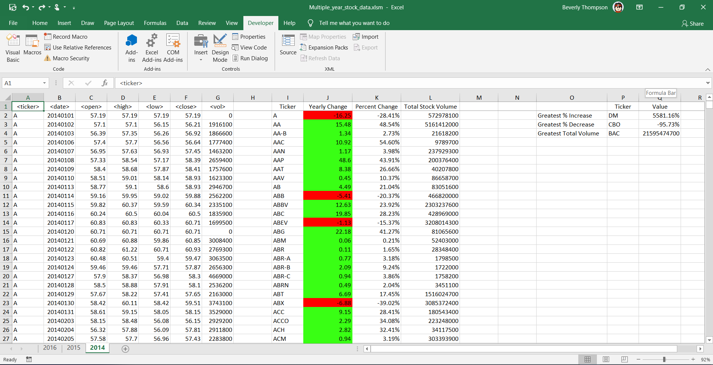
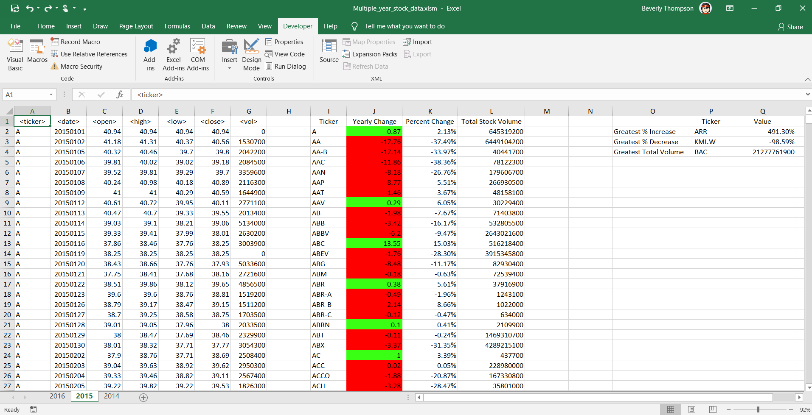
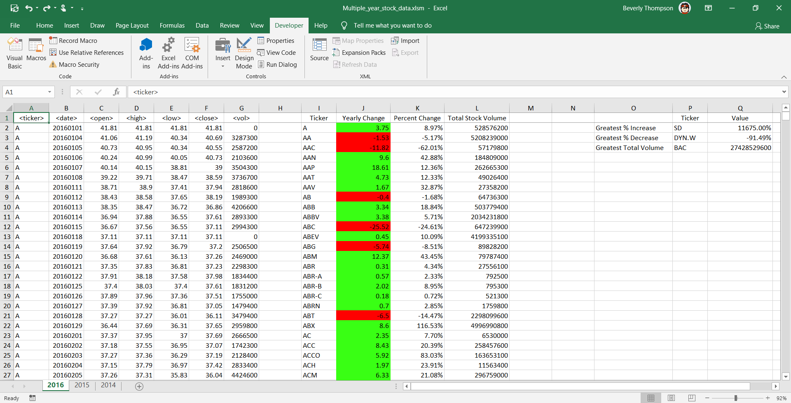

# VBA-challenge
VBA Homework - The VBA of Wall Street

## Instructions
* Create a script that will loop through all the stocks for one year and output the following information.
  * The ticker symbol.
  * Yearly change from opening price at the beginning of a given year to the closing price at the end of that year.
  * The percent change from opening price at the beginning of a given year to the closing price at the end of that year.
  * The total stock volume of the stock.
* You should also have conditional formatting that will highlight positive change in green and negative change in red.

## CHALLENGES
1. Your solution will also be able to return the stock with the "Greatest % increase", "Greatest % decrease" and "Greatest total volume".
2. Make the appropriate adjustments to your VBA script that will allow it to run on every worksheet, i.e., every year, just by running the VBA script once.

## Resources
alphabetical_testing.xlsm was utilized to test the scripts and was run on Multiple_year_stock_data.xlsm to complete the project.

## Subroutines
    Subroutines for the project
        1. ThroughWorksheets - This subroutine is the main script that runs. 
            This subroutine performs the following tasks:
            * Loops through all worksheets in the workbook in order to run the stocks subroutine.   
            * The top row is set to be frozen so that the heading stays when you scroll.
            * The zoom is set to 92% so that all data can be viewed.
        2. Stocks  - This subroutine does the work & creates the summary / greatest information for sheet sent as an argument.  
            This subroutine performs the following tasks: 
              * Add column headers for the summary by ticker data and the labels for the greatest information
              * Sort the data by ticker / date to ensure that the open / close price can be gotten from the first and last row.
              * Obtain the number of rows with data
              * Loop from row 2 to the last row with data creating the summary yearly change, percent change and total stock volume
              * Output the data in the summary section of the spreadsheet
              * If necessary update the greatest section of the spreadsheet with information from the summary data line
        3. BuildOutputRow - This subroutine outputs a row of summary ticker data.
            The summary takes as arguments, the sheet we are processing, the output row to update for the ticker and all 
            of the variables for that ticker that need to be updated to the sheet.
        4. CheckForGreatestChange - This subroutine compares summary ticker information to the greatest info / updates if needed.
            This subroutine receives the sheet and the output row of the summary ticker data that we want to compare to 
            the current Greatest values.If the summary ticker data is greater than any of the existing data for one of the greatest 
            categories then it is update with the ticker and the value.

## Execution
The process can be run by clicking on the Developer tab before clicking on Macros and then run ThroughWorksheets.

## Output

### 2014

### 2015

### 2016

